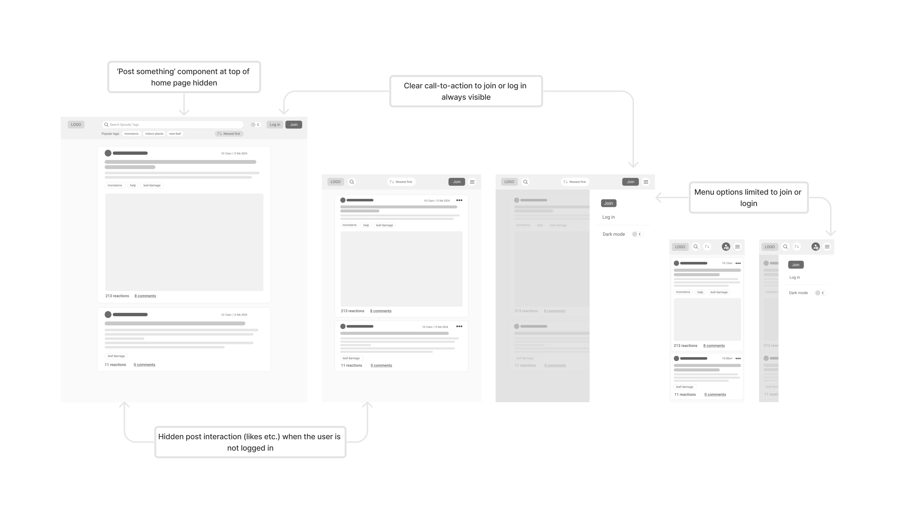
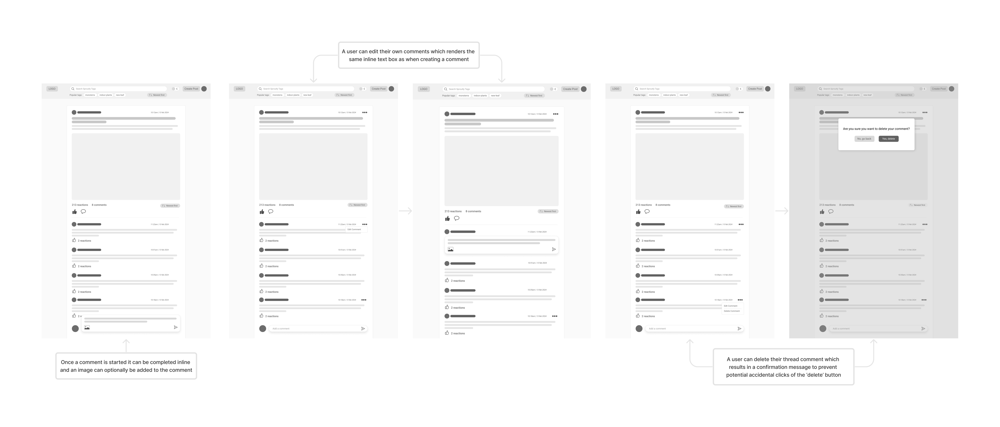
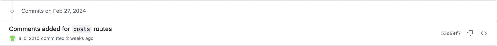
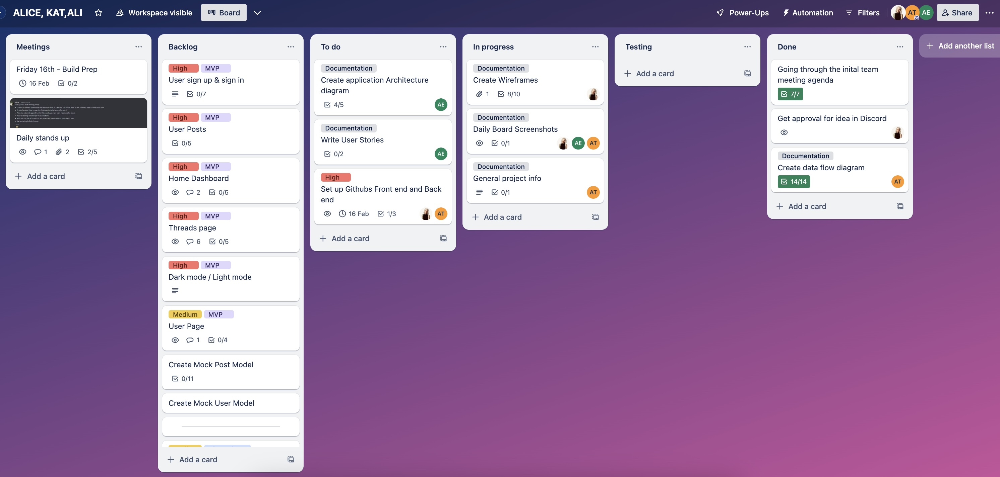

# Seedle 🪴

A full stack web application in development by **Ali Eideh**

#### [Seedle Github](https://github.com/ali012210/Seedle) 

# Table of Contents
- [Seedle 🪴](#seedle-)
      - [Seedle Github](#seedle-github)
- [Table of Contents](#table-of-contents)
- [General](#general)
  - [Purpose](#purpose)
  - [Functionality and Features](#functionality-and-features)
  - [Target Audience](#target-audience)
  - [Tech Stack](#tech-stack)
      - [MongoDB](#mongodb)
      - [Express.js](#expressjs)
      - [React](#react)
      - [Node.js](#nodejs)
- [Application Architecture](#application-architecture)
- [User Stories](#user-stories)
- [Wireframes](#wireframes)
    - [Home Page for logged in users](#home-page-for-logged-in-users)
    - [Home page for users that aren't logged in](#home-page-for-users-that-arent-logged-in)
    - [Searching based on Tags](#searching-based-on-tags)
    - [Creating a Post](#creating-a-post)
    - [Discarding a post](#discarding-a-post)
    - [Viewing threads](#viewing-threads)
    - [Commenting on threads](#commenting-on-threads)
    - [User login](#user-login)
    - [User sign up](#user-sign-up)
    - [User edit profile](#user-edit-profile)
    - [User view profile](#user-view-profile)
- [Source Control](#source-control)
  - [Screens](#screens)
  - [Methodology](#methodology)
- [Project Management](#project-management)
  - [Design and Planning](#design-and-planning)
  - [Deployment](#deployment)
  - [Kanban Task Delegation and Prioritisation](#kanban-task-delegation-and-prioritisation)

# General

## Purpose

Plant enthusiasts currently engage in fragmented online communities focused on various plant-related topics. However, there isn’t a dedicated platform that serves as a comprehensive hub for all things plants, similar to how Goodreads caters to book enthusiasts or IMDB to movie lovers. 

Through research and our own experience, many plant-lovers follow multiple different Facebook groups (such as ‘Plant Identification Australia’ or ‘Plant lovers Melbourne Victoria’) and then they also participate in forums in other places such as reddit (for example: r/houseplants and r/UrbanJungle). Based on this it's clear that people want to be able to talk about their plants and discuss plant-related topics, but they have to go to various other platforms in order to do so (facebook, reddit etc.), wouldn't it be easier if this could be done from a single platform?

Seedle is a solution to this problem, providing a unified forum platform where people can share their love of plants, ask questions and get plant help when they need it from others in the community.

## Functionality and Features
**Login and Sign up**
- New users are able to create a new account/profile
- Existing users are able to log in to their existing account using their username and password

**User Data**
- Users that are logged in are able to view and update their account details (name, username, password, profile picture).
- Users that are logged in will be able to have a unified view of their previous post and comment history.

**Thread Posts and Comments**
- Users that are logged in are able to start a thread through **creating a new post** with a title, content body and optional image
- Users that are logged in are able to comment on threads (content body). If a user is not logged in they are unable to comment on thread posts.
- All users (logged in or not logged in), will be able to **view** threads and their associated comments and images
- Users that are logged in are able to **edit** and their own comments and thread posts.
- All users are able to view the number of comments currently on a thread post.

**Search and filtering**
- All Users ware able to search threads universally by tags.
- All users are able to filter their homepage by date. This will be a limited choice between either ascending or descending order. This functionality also extends to comments on thread posts.

**Reactions**
- Users that are logged in are able to react (e.g. attribute a 'seed') to comments and thread posts.
- All users are able to view the number of reactions on a given thread post or comment.

**Infinite scroll**
- To enhance the user experience we will implement an infinite scroll feature on the user home page rather than pagination. This is in line with current industry standards and is a common user flow in similar applications in the market today.

**Dark Mode**
- To enhance user experience and prevent eyestrain we will implement a dark mode option which is a very popular web design feature.

## Target Audience

Given our purpose, our application is targeted towards those in the plant community, but additionally aimed towards Millennial and Gen-Z users.

In the past caring for plants was largely a hobby loved by older generations, and many platforms or forums that exist today are aimed towards that demographic. However since the COVID pandemic a younger audience has started to develop a love for plants, with a study by CivicScience showing that 21% of millenial and gen-z cohorts identify as 'plant parents'. 

For this reason, along with the fact that both groups are highly active and engaged in online communities in general, Seedle will be aimed towards those aged roughly between 18 - 40. In order to make our application attractive to our target audience we're going to place a high emphasis on bold and bright colours, modern UI components, interactivity and accessibility.

## Tech Stack

We will be using the MERN stack to create our application, which includes:

#### MongoDB
MongoDB serves as the database in the MERN stack, it's non-relational and excels at handling flexible data stored in JSON-like documents. MongoDB facilitates storage, retrieval, and manipulation of data which is crucial for our full stack applciation to work smoothly.

#### Express.js 
Express.js is a lightweight server-side framework. In particular it helps to simplify tasks such as routing, middleware handling, and request/response management. We will be using it to create our backend APIs and handle HTTP requests.

#### React
React is a frontend Javascript library that will enable us to build dynamic user interfaces. It facilitates the creation of reusable components, helps to manage state within the application, and efficiently updates the UI based on data changes. We will be using it to build our front-end web page, which will ultimately be a single-page application (SPA) where components will update without page reloads. 

#### Node.js
Node.js is a server-side JavaScript runtime that enables the running of JavaScript code outside of a web browser. It provides an event-driven, non-blocking model, making it efficient for handling asynchronous requests. Node.js will be used alongside Express.js to help develop our server-side tasks.

# Application Architecture

*Seedle* is a MERN, full-stack implementation. On the backend, the application is powered by a Node.js server running Express.js, which interfaces with a NoSQL MongoDB database. The frontend is built using React, rendering various UI components dynamically, including HTML, CSS and embedded JavaScript. React communicates with the backend via HTTP requests which via Express.js will facilitate Restful API calls. The application's frontend and backend are hosted on separate servers, with the frontend hosted on Netlify and the backend to be hosted on Render. With respect to the database, MongoDB Atlas will be the cloud service hosting it. The database itself interfaces with the Node.js backend server via the Object Data Modelling (ODM) library, Mongoose. 

 

# User Stories

- As a *logged in user*, I want to able to access the forum's full functionality (react, comment, etc.), so that I can contribute to the Seedle community directly.
   
- As a *browser*, I want full visibility of the forum's content (posts and threads) so that I can enjoy the full breadth of the community's contributions without having to sign up. 

- As a *user*, I want to be able to filter thread posts by tags, so that I can filter content to my specific plants,interests and/or needs.

- As a *logged in user*, I want to be able to create thread posts, so that I can contribute to the *Seedle* community.

- As a user with a *preference for content dense thread posting*, I want a 'discard post' alert box feature to mitigate losing my content to a misclick, so that I can focus on the quality of my content without fear of losing it. 

-  As a *browser*, I want to be able to sort thread posts and comments by date, to scope out the most recent and/or most relevant content.

- As a *logged in Seedle user* who is familiar with social media functionality, I want to be able to comment on threads no matter how far I have scrolled, so that I can conveniently engage with thread posts in a manner intuitive to me.

- As a *registered user of Seedle*, I would like to be welcomed by a simple login page, so that I can jump straight into the forum with ease. 

- As a *seasoned plant enthusiast* or *millenial plant newbie*, I would like to join the *Seedle* community so that I can showcase my lineup of plants and/or demonstrate and share my plant caring expertise.

- As a *registered Seedle user*, I would like to be able to edit my profile on a dedicated page, in a manner familiar to me (i.e. exact fields and presentation of the sign-up page), so that I can keep my profile relevant and my plant keeping record up to date.

- As a *registered Seedle user* with a desire to delete my profile, I would like an option on the edit profile page to facilitate this, so that I can erase my data from the forum and leave the community if I so choose.

- As a *browser* or *registered user* who is interested in a particular user's contributions, I would like to be able to view a page dedicated to their post history and total like count, so that I can view their contributions and engage more deeply with the community.

# Wireframes

### Home Page for logged in users

The home page serves as the entry point to our website. All users will be able to view this page, however some menu items and functionality will be limited to only those that are logged in (such as reacting, commenting, edit / view profile)

### Home page for users that aren't logged in

For users that have not signed up or are not logged in, they will still have full visibility of the forum posts and threads (so they can remain a 'browser'), but they will not be able to react to thread posts or add comments to thread posts. As such, some components and action items will be hidden from view.

### Searching based on Tags

All users are able to search the forum based on searching for existing tags and adding the tags as search parameters. This filters the thread posts based on the selected tags for the user. One or more tags can be added to the search and the search will match to any matching tag (not *all* matching tags - it doesn't increase specificity).

### Creating a Post

Users that are logged in will be able to create a thread post, either from the 'post something' homepage component or via the 'create post' button in the nav bar; both of which navigate to this create post component.

### Discarding a post

Users can discard a thread post if they no longer wish to continue; this will prompt for confirmation from the user before it is actioned.

### Viewing threads

All users are able to view threads, however 'browsers' have limited actions outside of 'viewing'.

### Commenting on threads

If the user is logged in, they are able to add new comments, edit comments and delete comments on thread posts.

### User login

The login page is where an existing user can enter their credentials to log back into their user account. This page can be accessed from the 'login' button in the navbar.

### User sign up

The signup page is where a new user can create a new account for Sproutly. This page can be accessed from the 'Join' button in the navbar.

### User edit profile

Logged in users are able to edit their user details through clicking either the profile picture icon (desktop) or the 'edit profile' button in the nav bar.

### User view profile

All users are able to view another users public profile through clicking on their username (via a thread post or comment). If a user is logged in, they are also able to navigate to view their own public profile through clicking on the profile picture icon (desktop) or the 'view profile' button in the nav bar. 

 

# Testing

## Development Testing

 

# Source Control

## Screens

#### February 21st

#### February 22nd

#### February 27th

#### February 28th

#### February 29th

#### March 1st

#### March 2nd

#### March 3rd

#### March 4th

#### March 5th

#### March 6th

#### March 7th

#### March 8th

#### March 9th

#### March 10th

## Methodology

#### *Monorepo, Centralised Source of Truth Approach*

Given that Seedle is a single person dev enterprise, I choose a simple, main branch exclusive approach. Not without its flaws and risks, I acknowledge that this approach is not scalable for larger teams, but for a solo dev, it was a simple and effective way to manage the project.

Utilising a monorepo for both my client and server codebases kept my project's components together, offering a single source of truth. This was beneficial to me to the extent that my client and server were intertwined and dependent on one another which made dependency management and versioning easier. By committing directly to the main branch, I ensured I was always working with the most up-to-date version of my codebase. The linear and unified version history made tracking changes and debugging easier, and the single source of truth made it easier. It also meant that features and fixes were integrated immediately. 

Certainly, adopting additional source control best practices such as feature branching and pull requests would have helped isolate work in progress, bugs and experimental features. It would have also provided the impetus to review my code thoroughly and will thus be a practice I will adopt in future projects where I am involved in a team setting.

 

# Project Management

### Trello Board Screenshots

## Kanban Task Delegation and Prioritisation

Taking on Seedle as an individual developer, managing a Kanban board with a nuanced approach to task delegation and prioritization was essential for maintaining productivity and ensuring project momentum. At the crux of my Kanban approach was the employment of a priority levels (low, medium, high) alongside difficulty metrics (easy, moderate, challenging) system. This provided a structured yet flexible framework for managing tasks which allowed me to balance my workload effectively and ensure that critical tasks were prioritized while also allowing for skill development and preventing burnout.

### Priority Levels

- **Low Priority (Green):** Tasks that, while they may improve the project, were not immediately critical. This could include refactoring code for better readability or implementing non-essential features.
- **Medium Priority (Amber):** Important tasks that did not have immediate deadlines but should have been completed in a timely manner to enhance the project's functionality and user experience. 
- **High Priority (Red):** Tasks that are crucial for the project's timely deployment (Unfortunately, I have a little more development necessary to get Seedle off the ground- The fundementals I believe are in place however!).

### Difficulty Metrics

- **Easy (Light Purple):** Tasks that are straightforward and require minimal time and effort. 
- **Moderate (Purple):** These tasks may require a bit more time and possibly research or learning new tools but are manageable.
- **Challenging (Deep Purple):** Tasks that are complex, requiring significant time, advanced skills, or substantial architectural changes.

### Balancing Strategy

1. **Start With High-Priority Tasks:** Each day, I identified and tackled high-priority tasks first, regardless of their difficulty. This ensured that crucial project milestones were not too far delayed.

2. **Mix Tasks to Manage Energy and Time:** I always tried to maintain balance with my day with a mix of tasks across different difficulty levels. After completing a challenging task, I would switch to an easier task. This helped in managing energy levels and prevented getting too m=demotivated on any given day.

3. **End Day with Low-Priority or Easy Tasks:** I would typically schedule low-priority or easy tasks towards the end of the day. These tasks, often being less demanding, would provide a sense of accomplishment and allow me to wind down.

4. **Task Slicing for Challenging Tickets:** If a task was too challenging or beyond my capabilities at the time, I would give myself license to break it down into smaller, more mundane chunks. This approach, while tedious, would often allow me to make breakthroughs in understanding and provided opportunity for skill development by intricately understanding the problem and would facilitate critical thinking.
